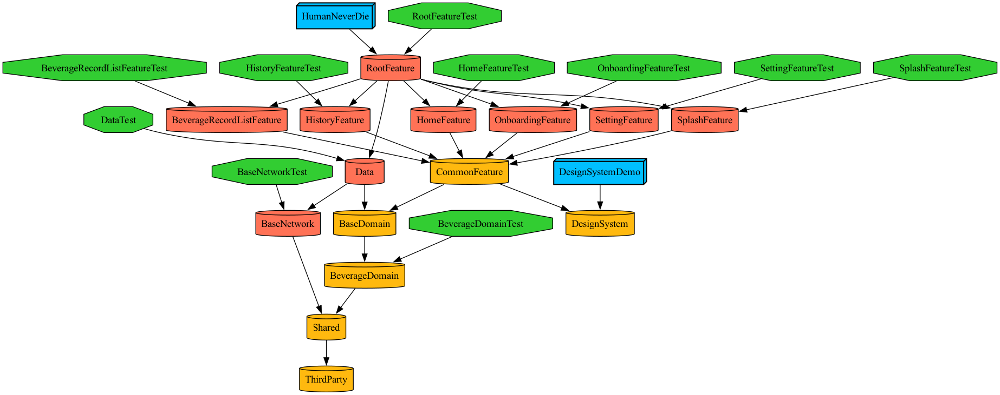

# 아맞당 (Amatdang)

### [📱 앱 설치하러 가기](https://apps.apple.com/kr/app/%EC%95%84%EB%A7%9E%EB%8B%B9-%EC%B9%B4%ED%8E%98-%EC%9D%8C%EB%A3%8C-%EB%8B%B9%EB%A5%98-%EA%B8%B0%EB%A1%9D/id6748367287)

> 카페 음료 속 당류를 가장 귀엽게 관리하는 법, **아맞당**

### 주요 기능
- 간편 기록 — 카페 음료 섭취 & 당류 기록
- 맞춤 목표 — 개인별 당류 섭취 목표 설정 및 달성 관리
- 음료 정보 — 프랜차이즈 카페 메뉴별 당류 정보 조회

# ⚙️ 개발환경 및 기술스택

- **Minimum Deployment**: iOS 18.0
- **Swift Version**: 6.0
- **Dependency Manager**: SPM (Tuist 통합)
- **Project Generator**: Tuist 4.48.2
- **Architecture**: SwiftUI · `@Observable` 기반 MVVM · `swift-dependencies` 1.9.2 DI · Swift Concurrency · Clean Architecture (Domain / Data 레이어 분리)
- **Networking**: Alamofire 5.10.2
- **Local Persistence**: SwiftData (iOS 17+)
- **Authentication**: Apple Sign-In · Auth0.swift 2.14.0
- **Analytics**: Amplitude-Swift 1.15.0
- **Push Notifications**: Firebase iOS SDK 12.3.0 (Messaging)
- **Testing**: Swift Testing (`@Suite` · `@Test` · `#expect`)
- **3rd Party**: Lottie 4.5.2 · Nuke (NukeUI) · Swift Async Algorithms 1.0.4

# 🧩 모듈 구조

**Tuist 기반 멀티 모듈 구조**에 **`swift-dependencies` 기반 `@DependencyClient` struct-of-closures 패턴**을 적용하여 Clean Architecture(Domain · Data · Feature) 레이어 분리를 엄격히 강제합니다.

- **App (AMatDang)** — 앱 타겟
- **RootFeature** — Composition Root. `@retroactive DependencyKey.liveValue` 확장을 한 곳에 모아 전체 DI 와이어링 담당
- **Features** — SwiftUI `@Observable` ViewModel 기반 Feature 레이어 (`Splash` · `Auth` · `Onboarding` · `Home` · `History` · `BeverageRecordList` · `Setting`)
- **CommonFeature / DesignSystem** — 공용 UI 컴포넌트 및 디자인 시스템
- **Domain** — `@DependencyClient` struct UseCase + RepositoryInterface 선언 (`BaseDomain` · `AuthDomain` · `BeverageDomain` · `UserDomain`). `.live` 팩토리는 Domain 내부(`<X>UseCase+Live.swift`)에 함께 포함해 Data 의존 없이 컴포지션만 담당
- **Data** — Domain RepositoryInterface의 `.live` 구현. BaseNetwork / LocalDataBase / Apple 로그인 연동
  - **BaseNetwork** — Alamofire 기반 네트워크 추상화 (`AMDNetworkService`)
  - **LocalDataBase** — SwiftData 기반 로컬 저장소 (`AMDLocalDataBaseService`)
- **Shared / ThirdParty** — 값 타입·에러·플랫폼 클라이언트 프로토콜(Keychain, UserDefault, Amplitude, Network, AppleLogin) 및 외부 라이브러리 경계
